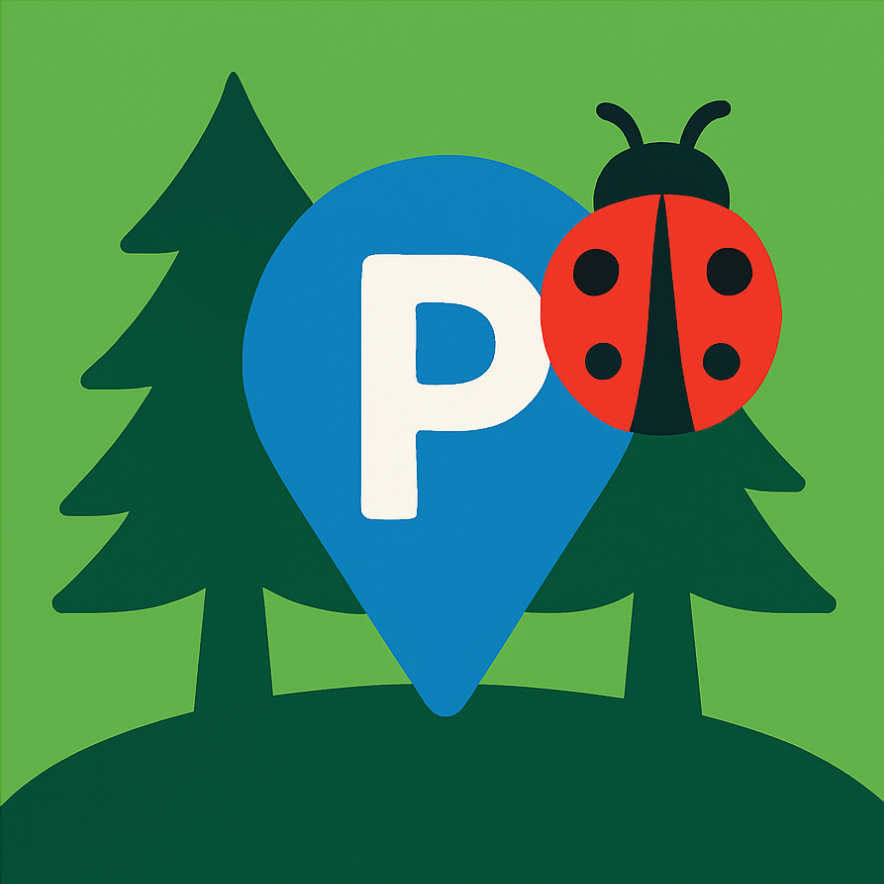
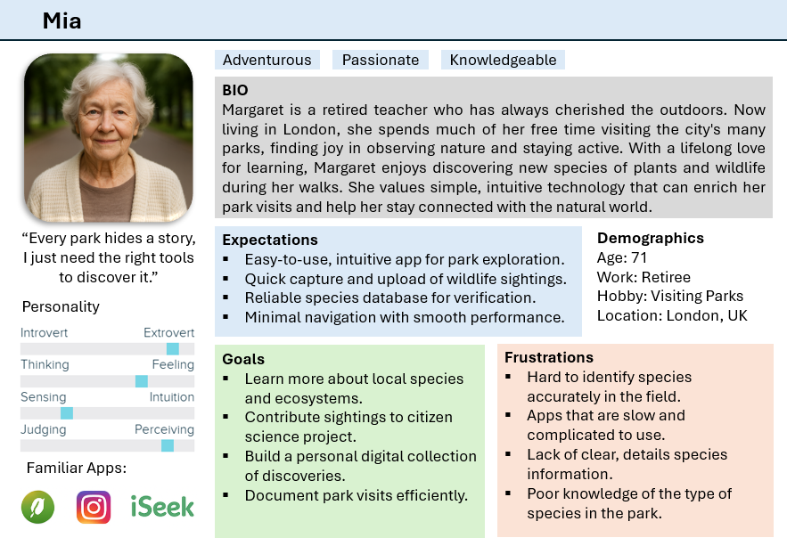
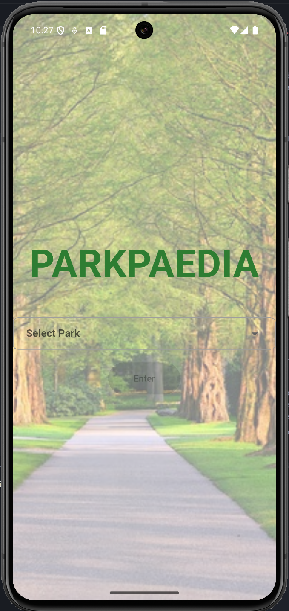
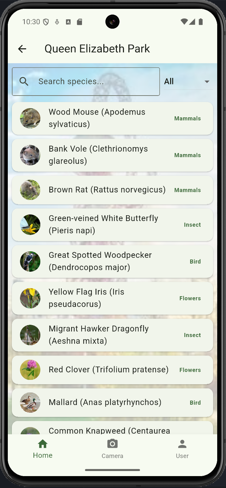
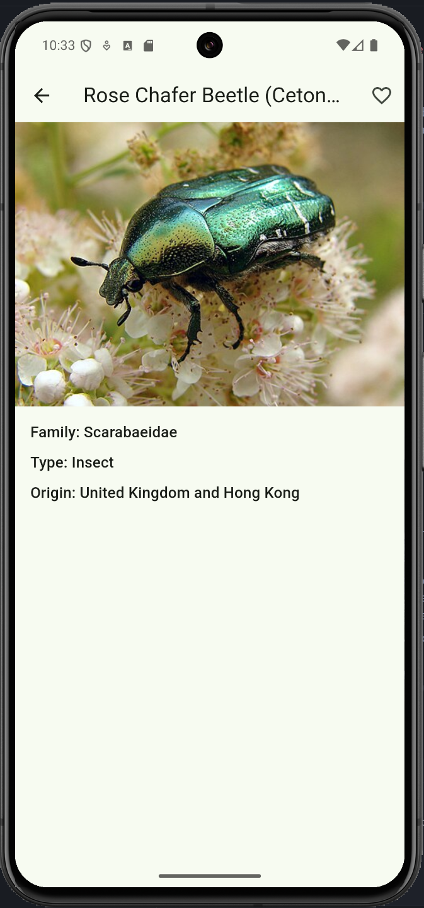
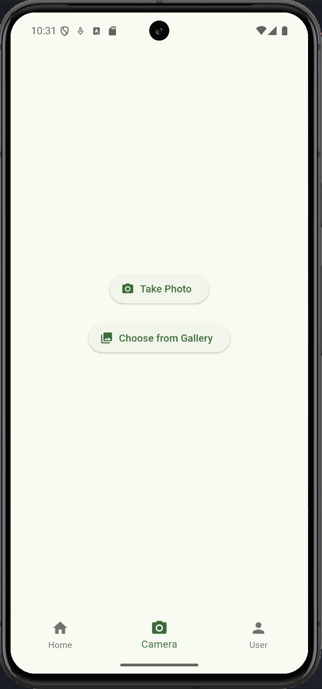
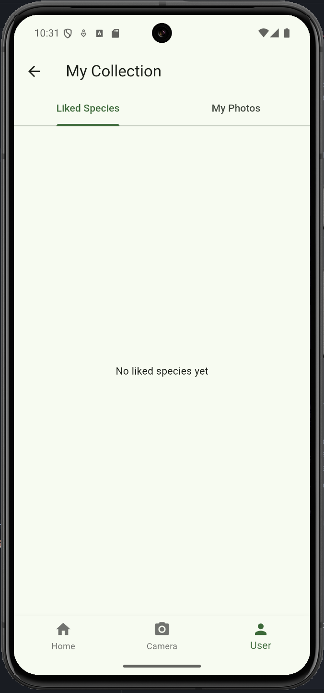
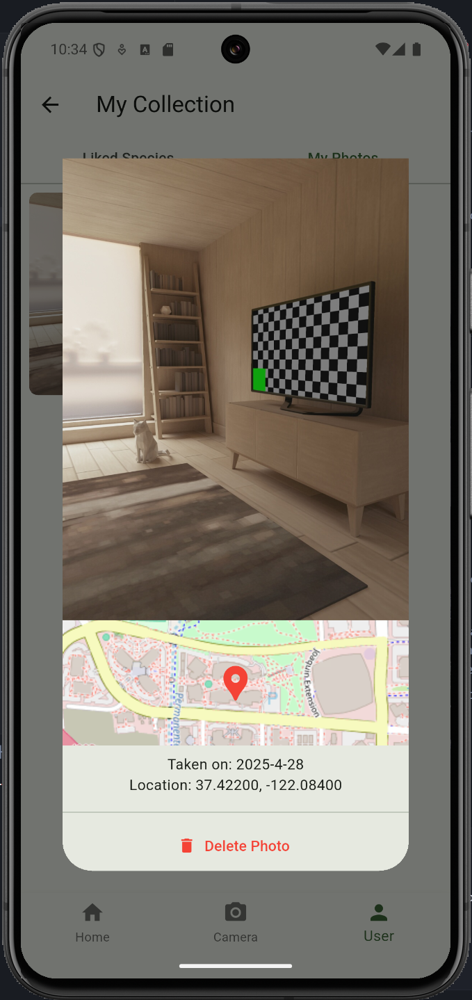
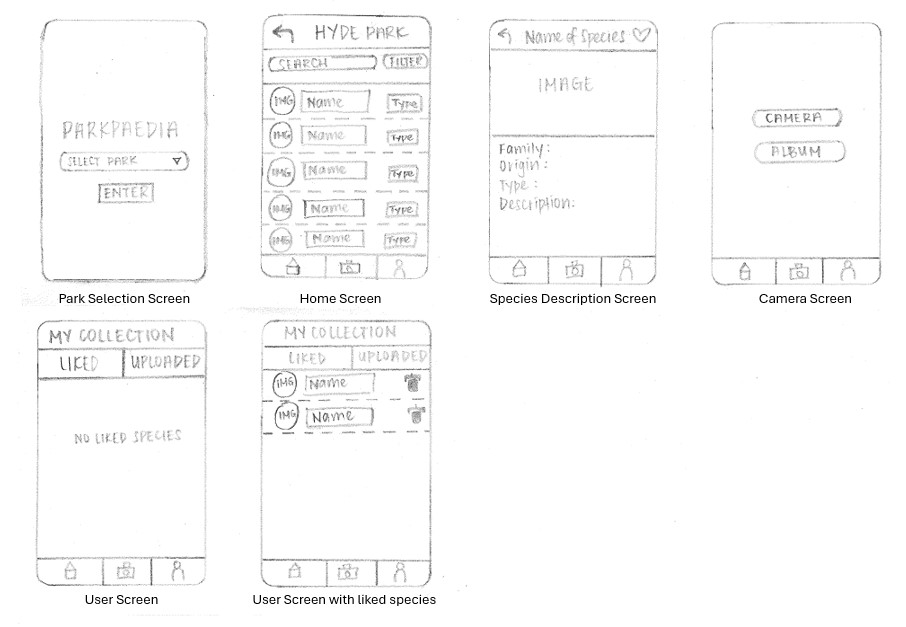

<p align="center"></p>
<h1 align="center">PARKPAEDIA<br><span style="font-size: 10px;">Discover Nature in the City</h1>
 


### App Description
**PARKPAEDIA** is a Flutter-based cross-platform mobile application that transforms the way users explore and learn about the biodiversity of London's parks. Acting as an interactive encyclopedia, the app enables users to browse parks, discover detailed species records, and engage with a rich educational database featuring birds, insects, flowers, mammals, and even plants.

With integrated geolocation services and cloud data management ([Firebase](https://firebase.google.com/)), users can easily capture and upload GPS-tagged sightings, build a personal collection of liked and uploaded species, and contribute to citizen science efforts. Designed with an intuitive and user-friendly interface, **PARKPAEDIA** makes urban nature exploration accessible and engaging for families, nature enthusiasts, and the wider community—bringing the hidden life of London’s parks into the palm of your hand.
  
### Landing Page
[https://kevintan99.github.io/casa0015-Parkpaedia/](https://kevintan99.github.io/casa0015-Parkpaedia/)
  
### Key Features
**🏞️ Explore Parks:** Browse a directory of London parks, each featuring a collection of species living within them directly from [Firebase](https://firebase.google.com/).

**🌳 Species Information:** Access detailed profiles for birds, insects, flowers, and plants, including names, origins, and images.

**📷 Camera Uploads:** Capture new species sightings using the in-app camera and automatically upload them with GPS tagging.

**👨 User Profile:** View and manage your liked species and your personal uploaded sightings.

**📱 Educational Tool:** Learn more about local biodiversity through the user-friendly interface.
  
### User Persona

  
### Screens
<table>
  <tr>
    <td>
      
    </td>
    <td>
      
    </td>
    <td>
      
    </td>
  </tr>
</table>

<table>
  <tr>
    <td>
      
    </td>
    <td>
      
    </td>
    <td>
      
    </td>
  </tr>
</table>

  
### Storyboard

  
### Development Environment
```
$ flutter --version
Flutter 3.29.3 • channel stable • https://github.com/flutter/flutter.git
Framework • revision ea121f8859 (2 weeks ago) • 2025-04-11 19:10:07 +0000
Engine • revision cf56914b32
Tools • Dart 3.7.2 • DevTools 2.42.3
```
  
### Installation Process
- Install Flutter and Dart
- Install a simulation device or have a phone plugged to the main machine
  
```bash
git clone https://github.com/Kevintan99/casa0015-Parkpaedia.git
cd casa0015-Parkpaedia
flutter pub get
flutter run
```
### Contact Details
Feel free to contact me at the email provided below if you have any questions or feedbacks regarding the application.
  
Email: Jan.tan.24@ucl.ac.uk
